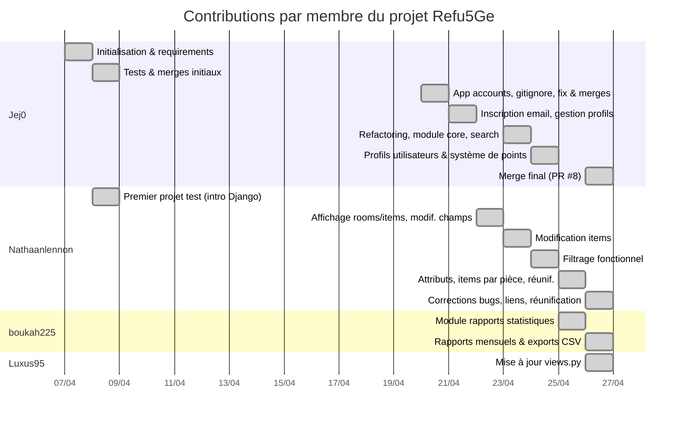

# Diagramme de Gantt — Contributions par membre

Ce diagramme retrace les ajouts de chaque membre du projet dans le temps, basé sur l'historique des commits GitHub.

## Détail des contributions

### Jej0
| Date | Commit |
|------|--------|
| 07/04/2026 | Initialisation du projet, requirements |
| 08/04/2026 | Tests, merges initiaux |
| 20/04/2026 | App `accounts` (auth, templates), gitignore, fix, merge PR #2 |
| 21/04/2026 | Inscription avec vérification email, gestion des profils |
| 23/04/2026 | Refactoring profils, module `core`, amélioration de la recherche |
| 24/04/2026 | Système de points et niveau pour les profils utilisateurs |
| 26/04/2026 | Merge final de la branche réunification (PR #8) |

### Nathaanlennon
| Date | Commit |
|------|--------|
| 08/04/2026 | Premier projet test Django |
| 22/04/2026 | Affichage basique rooms/items, modification de champs hors admin |
| 23/04/2026 | Modification d'items |
| 24/04/2026 | Filtrage fonctionnel |
| 25/04/2026 | Ajout d'attributs, items par pièce, réunification avec boukah225 |
| 26/04/2026 | Corrections de bugs, ajout de liens, finalisation de la réunification |

### boukah225
| Date | Commit |
|------|--------|
| 25/04/2026 | Module rapports statistiques, surveillance des ressources |
| 26/04/2026 | Rapport mensuel par pièce, exports CSV, corrections |

### Luxus95
| Date | Commit |
|------|--------|
| 26/04/2026 | Mise à jour de `views.py` |
